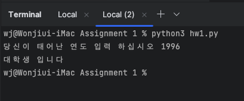
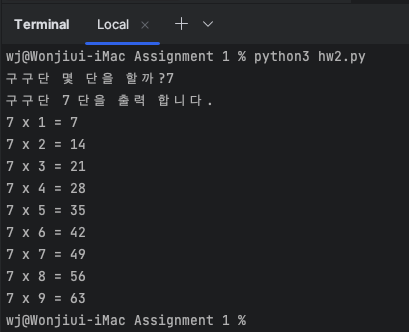
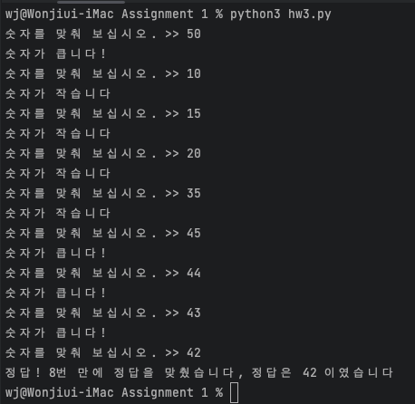
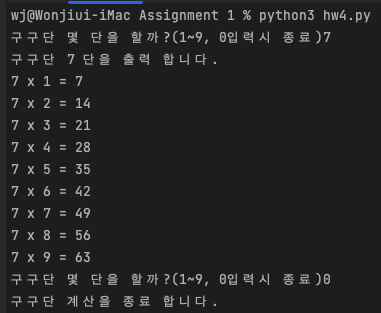
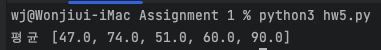

Machine Learning Programming with Python
===
>머신러닝 프로그래밍 파이썬 과제 1
## Screenshots 📸 🖼
### [hw1.py](hw1.py)

### [hw2.py](hw2.py)

### [hw3.py](hw3.py)

### [hw4.py](hw4.py)

### [hw5.py](hw5.py)
