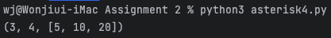

Machine Learning Programming with Python
===
>머신러닝 프로그래밍 파이썬 과제 2
## Screenshots 📸 🖼

> ### [hello1.py](hello1.py)
>

> ### [call1.py](call1.py)
>

> ### [call2.py](call2.py)
>

> ### [asterisk1.py](asterisk1.py)
>

> ### [asterisk2.py](asterisk2.py)
>

> ### [asterisk3.py](asterisk3.py)
>

> ### [asterisk4.py](asterisk4.py)
>