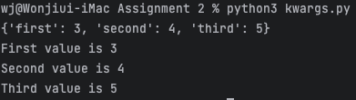

Machine Learning Programming with Python
===
>머신러닝 프로그래밍 파이썬 과제 2
## Screenshots 📸 🖼

> ### [hello1.py](hello1.py)
>

> ### [hello2.py](hello2.py)
>

> ### [parameter.py](parameter.py)
>

> ### [function.py](function.py)
>

> ### [function_type.py](function_type.py)
>

> ### [keyword.py](keyword.py)
>

> ### [default.py](default.py)
>

> ### [call1.py](call1.py)
>

> ### [call2.py](call2.py)
>

> ### [asterisk1.py](asterisk1.py)
>

> ### [asterisk2.py](asterisk2.py)
>

> ### [asterisk3.py](asterisk3.py)
>

> ### [asterisk4.py](asterisk4.py)
>

> ### [local_variable.py](local_variable.py)
>

> ### [global_variable.py](global_variable.py)
>

> ### [factorial.py](factorial.py)
>

> ### [kwargs.py](kwargs.py)
>

> ### [math1.py](math1.py)
>

> ### [math2.py](math2.py)
>
 
> ### [rectanglr_area.py](rectanglr_area.py)
>

> ### [scoping_rule.py](scoping_rule.py)
>

> ### [scoping_rule_final.py](scoping_rule_final.py)
>
